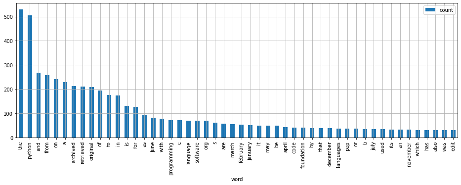

## Miantiao

`miantiao`帮助你编写很长的面条(意面)程序。该模块提供了两个装饰器：`pipe`和`call_pipe`。详细用法请查看
`test_miantiao.ipynb`。

`miantiao` helps you write very long noodle (spaghetti) programs. This module provides two decorators: `pipe` and `call_pipe`. For detailed usage, please see
`test_miantiao.ipynb`.

```python
import requests
from bs4 import BeautifulSoup
import re
from collections import Counter
import pandas as pd
from miantiao import pipe

@pipe
def word_count(url):
    requests.get() #>#
    P.text #>#
    BeautifulSoup('html.parser') #>#
    P.html.text #>#
    re.findall(r'[A-Za-z]+') #>#
    map(str.lower) #>#
    Counter() #>#
    most_common(50) #>#
    pd.DataFrame(columns=['word', 'count']) #>#
    plot.bar(x='word', y='count', figsize=(16, 5), grid=True)

r = word_count('https://en.wikipedia.org/wiki/Python_(programming_language)');
```



你可以根据个人喜好更换管道运算符，例如使用`#->`，`#%>%`，或者根本不用管道运算符。

在`@pipe`装饰的函数中，函数调用的表达式会按照如下的规则进行改写：

1. 在管道中始终存在一个当前对象，所有的函数调用都默认对该对象进行处理，调用结束时，将当前对象设置为调用的返回值。在运行之前，被装饰函数的第一个参数会被设置为当前对象。
1. 在程序中可以使用`P`获取管道中的当前对象。
1. 调用名字的优先级别从高到低为：局域函数，全局函数，内置函数，当前对象的方法。如果调用名字以`P.`开头，则调用当前对象的方法。
1. 若名字为局域函数，全局函数，内置函数，默认将管道的对象作为第一个参数传递给它。例如`myfunc(1, 2, 3)`会被改写为`myfunc(P, 1, 2, 3)`。
1. 可在`data_arg_position`字典指定参数的位置。例如`'builtins.map': 1`表示调用`map`函数时，将管道中的对象作为第二个参数传递。`map(f)`会被改写为调用`map(f, P)`。
1. 若调用参数中出现`P`，则不另外将当前对象自动添加到参数中。例如`map(f, P)`不会被改写为`map(f, P, P)`。注意使用`P`的表达式不算，例如`myfunc(1, P[:2])`会被改写为`myfunc(P, 1, P[:2])`。

下标表达式按照下面的规则改写：

1. 当它是`P`的下标表达式时，直接改为赋值语句。例如`P[:10]`，被改写为`P = P[:10]`。
2. 若下标表达式有名字，则从当前对象获取同名的属性。例如：`loc[:10]`，被改写为`P = P.loc[:10]`。

当函数调用或下标读取的返回值为`None`时，不会改写当前对象。

若表达式为属性链，会被改写为对`P`的赋值语句。例如`P.html.text`，被改写`P = P.html.text`。

前面的`word_count`函数会运行与下面相似的代码：

```python
def word_count(url):
    P = url
    P = requests.get(P)
    P = P.text
    P = BeautifulSoup(P, 'html.parser')
    P = P.html.text
    P = re.findall(r'[A-Za-z]+', P)
    P= map(str.lower, P)
    P = Counter(P)
    P = P.most_common(50)
    P = pd.DataFrame(P, columns=['word', 'count']) #>#
    P = P.plot.bar(x='word', y='count', figsize=(16, 5), grid=True)
    return P
```    